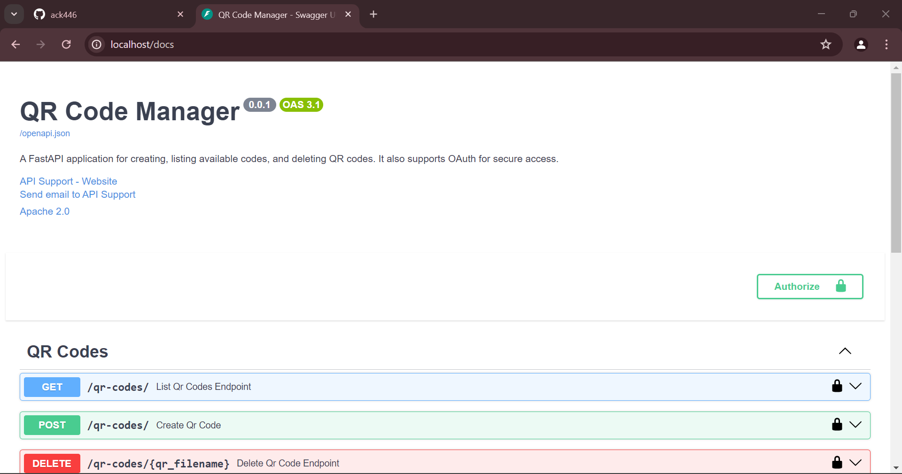

# Homework9

## RestAPI for Creating QR Codes

## Screenshots

1.  Screenshot of the image in CI/CD Pipeline here.

CI/CD Pipeline : [https://github.com/ack446/Homework9/deployments/production](https://github.com/ack446/Homework9/deployments/production)

2.  Screenshot of the image in Docker account here.

Docker Hub : [https://hub.docker.com/repository/docker/ack446/qr_code_api_fix_broken_code/general](https://hub.docker.com/repository/docker/ack446/qr_code_api_fix_broken_code/general)

3.  Screenshot of the docker image running on localhost.

4.  Screenshot of the QR Code Manager running on localhost.

Localhost : [http://localhost/docs](http://localhost/docs)

5.  Screenshot of viewing QR Codes list using the QR Code Manager on localhost.

Localhost : [http://localhost/docs](http://localhost/docs)

6.  Screenshot of creating QR Codes using the QR Code Manager on localhost.

Localhost : [http://localhost/docs](http://localhost/docs)

7.  Screenshot of deleting QR Codes using the QR Code Manager on localhost.

Localhost : [http://localhost/docs](http://localhost/docs)

